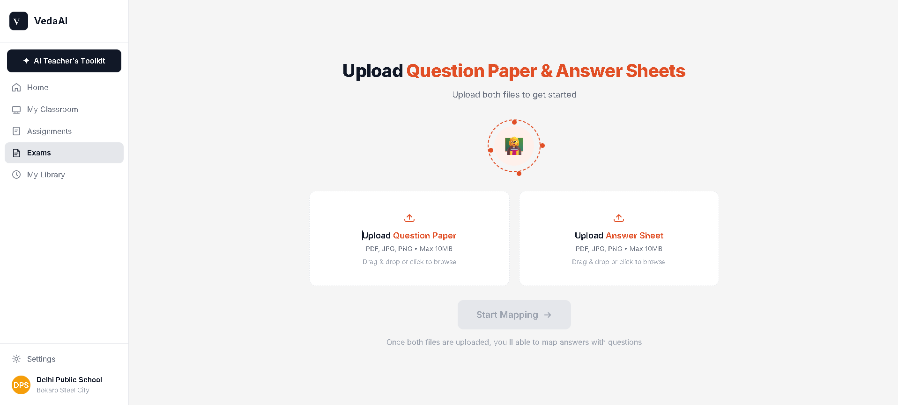

# VedaAI Grader — AI-Powered Answer Sheet Evaluation



A full-stack web application that lets teachers upload a question paper and a student's handwritten answer sheet, then automatically extracts questions, maps answers, highlights regions on the answer sheet, and provides AI-generated grades and feedback.

## Live Demo
🔗 **[Live URL](https://vedaai-grader.vercel.app)**

## Features
- 📤 **Upload** question papers and answer sheets (PDF, JPG, PNG)
- 🤖 **AI Extraction** using Google Gemini 2.0 Flash — extracts every question and every handwritten answer
- 🔗 **Intelligent Mapping** — matches answers to questions by label, falls back to semantic similarity
- ✏️ **Highlight Overlay** — click a question to see exactly where the answer is on the sheet
- 📊 **Grading & Feedback** — per-question scores, verdicts (correct/partial/incorrect), AI feedback
- 📋 **Summary** — total score, answered/unanswered counts, overall AI feedback
- ⚠️ **Edge Case Handling** — unanswered questions, orphan answers, out-of-order answers, multi-page answers

## Setup

### Prerequisites
- Node.js 18+
- npm 9+
- Google Gemini API key (free at [aistudio.google.com](https://aistudio.google.com/app/apikey))

### Install

```bash
cd vedaai-grader
npm install
```

### Environment Variables

Copy the example file and fill in your API key:

```bash
cp .env.local.example .env.local
```

Edit `.env.local`:
```
GEMINI_API_KEY=your_actual_gemini_api_key_here
```

### Run Locally

```bash
npm run dev
```

Open [http://localhost:3000](http://localhost:3000)

## Deployment (Vercel)

1. Push this repository to GitHub
2. Import into [Vercel](https://vercel.com/new)
3. Add `GEMINI_API_KEY` as an Environment Variable in Vercel Project Settings
4. Deploy

> **Note**: Set the Vercel function timeout to 300 seconds (max) in `vercel.json` or project settings, as large PDFs with many questions can take 2-4 minutes to process.

## Architecture

### Tech Stack
- **Framework**: Next.js 14 (App Router, TypeScript)
- **Styling**: Tailwind CSS + inline styles (matching Figma design exactly)
- **AI Model**: Google Gemini 2.0 Flash (multimodal — reads images/PDFs and returns structured JSON)
- **PDF Rendering**: pdfjs-dist + node-canvas (server-side PDF → PNG conversion)
- **Storage**: In-memory (Map) — no database needed; session data lives for the duration of the request

### Processing Pipeline

```
Upload → PDF→Images → Gemini Q-Extraction → Gemini A-Extraction → Mapping → Gemini Grading → Review UI
```

1. **Upload** (`POST /api/upload`): Receives both files, starts async processing, returns `sessionId`
2. **PDF→Images**: Uses pdfjs-dist + node-canvas to render each PDF page at 2x scale as PNG
3. **Question Extraction**: Sends question paper page images to Gemini with a structured JSON prompt requiring:
   - Exact question numbers preserved (`11(a)`, `11(b)` as separate entries)
   - Normalized bounding boxes (0–1 scale) for each question
4. **Answer Extraction**: Sends answer sheet page images to Gemini requiring:
   - Student-written question labels (`Q1`, `Ans 3`, etc.) as `matched_question_number`
   - Bounding boxes per page (supports multi-page answers)
   - Best-effort handwriting transcription
5. **Mapping** (server-side):
   - **Pass 1** (confirmed): Match by exact `matched_question_number` ↔ question number (normalized)
   - **Pass 2** (inferred): For unmatched pairs, call Gemini for semantic similarity comparison
   - **Buckets**: Matched (confirmed/inferred), Unanswered, Orphan
6. **Grading**: One Gemini call per matched question → score, verdict, feedback; unanswered = 0
7. **SSE Stream** (`GET /api/status/[sessionId]`): Real-time stage/progress updates to the frontend
8. **Results** (`GET /api/results/[sessionId]`): Final JSON with all data

### Matching Logic

```
normalizeNumber("Q 11 (a)") → "11a"
normalizeNumber("11(a)")     → "11a"
// Matches!
```

For unlabeled answers: Gemini compares answer text against unmatched question texts and returns a confidence score. Matches with confidence ≥ 0.6 are marked "inferred" (amber chips).

## AI Model Used

**Gemini 3.6 Flash** (`gemini-3.6-flash`)
- Chosen for: free tier availability, multimodal (image and PDF understanding), fast response, structured JSON output via `responseMimeType: "application/json"`
- All API calls use `temperature: 0.1` for deterministic, structured extraction

## Known Limitations & Assumptions

1. **Handwriting legibility**: Gemini's OCR quality depends on image clarity. Blurry or rotated photos may reduce extraction accuracy. A warning banner is shown if quality is low.
2. **Bounding box accuracy**: Gemini returns normalized bounding boxes with ~±5% margin of error. Highlights may not be pixel-perfect for very small answer regions.
3. **PDF rendering**: Handled natively by Gemini. Canvas-based highlights are rendered on the frontend for images; PDFs are embedded using iframe.
4. **Processing time**: Large PDFs (10+ pages) take 2-5 minutes due to multiple sequential Gemini calls. The SSE progress stream keeps the user informed.
5. **Session lifetime**: In-memory sessions are lost on server restart. For production, a Redis/database store would be needed.
6. **Max score inference**: If the question paper doesn't explicitly state marks, defaults to 2 marks per question.
7. **Language**: Optimized for English. Other languages may work but are not tested.
8. **File size**: Max 10MB per file (enforced in UI). Very large PDFs may hit Gemini's token limits.

## Project Structure

```
vedaai-grader/
├── src/
│   ├── app/
│   │   ├── api/
│   │   │   ├── upload/route.ts          # Main processing endpoint
│   │   │   ├── status/[sessionId]/      # SSE progress stream
│   │   │   └── results/[sessionId]/     # Final results
│   │   ├── globals.css                  # Design tokens + animations
│   │   ├── layout.tsx                   # Root layout
│   │   └── page.tsx                     # Upload screen
│   ├── components/
│   │   ├── Sidebar.tsx                  # VedaAI sidebar nav
│   │   ├── ProgressScreen.tsx           # Loading state with sparkles
│   │   ├── ReviewScreen.tsx             # Two-pane review layout
│   │   ├── QuestionList.tsx             # Left pane: question cards
│   │   ├── AnswerSheetViewer.tsx        # Right pane: image + overlays
│   │   ├── GradingSummary.tsx           # Score header bar
│   │   └── StatusChip.tsx              # Status/confidence chips
│   └── lib/
│       ├── types.ts                     # Shared TypeScript types
│       ├── gemini.ts                    # Gemini API integration
│       ├── pdf-utils.ts                 # PDF → images conversion
│       └── session-store.ts             # In-memory session store
└── next.config.ts
```
